<!--
レイアウトの約束
- 背景を薄いグレーにして、白いスクリーンショットとの境目を見やすくしている
- 操作スライドは「左に説明・右にスクショ」。1280x800 の画像を right:64% contain で置く
- **太字** は赤字になる。画像の赤枠で囲んだ部品の名前に使い、枠と対応させる
- 画像は scripts/make_manual.py で撮り直せる
-->

<!-- _class: cover -->
<!-- _paginate: false -->

# robot-motion<br>使い方マニュアル

ロボットアームの関節角度の軌道を作り、robot-viser の 3D 表示で再生・確認するアプリ

2026-09 版

---

## このアプリでできること

| 動作モード | できること |
|---|---|
| PTP（関節補間・台形速度） | 全関節を同時に動かし、同時に目標へ着く軌道を作る |
| LIN（直線補間・台形速度） | 先端（ツールを付ける面）がまっすぐ動く軌道を作る |
| PTP（RMP 目標到達ポリシー） | 先端を目標へ寄せていく軌道を作る。障害物を避けられる |
| 経路追従（RMP・経由点の折れ線） | 経由点を結ぶ線に沿って先端を動かす。障害物を避けられる |
| 測定動作（レーザートラッカー校正） | トラッカーから見える測定点を選び、順に回る動作を作る |

どのモードでも、作った軌道はグラフで確認し、3D 表示での再生と CSV での保存ができます。

スクリーンショットの **赤枠** が操作する場所です。

---

<!-- header: 基本の操作 -->

## 1. 画面を開く

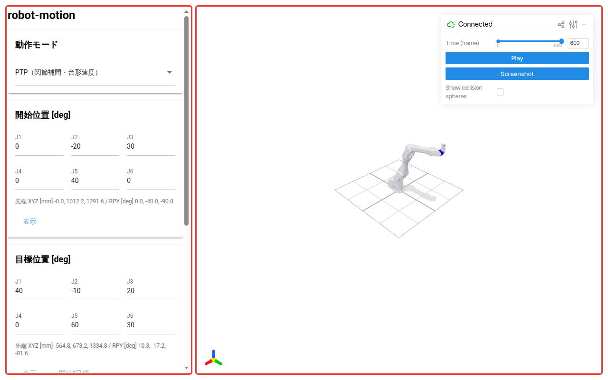

- ブラウザで `http://localhost:8180` を開く
- **左** が設定、**右** が robot-viser の 3D 表示
- 先に robot-viser-app を起動しておく

---

## 2. 動作モードを選ぶ

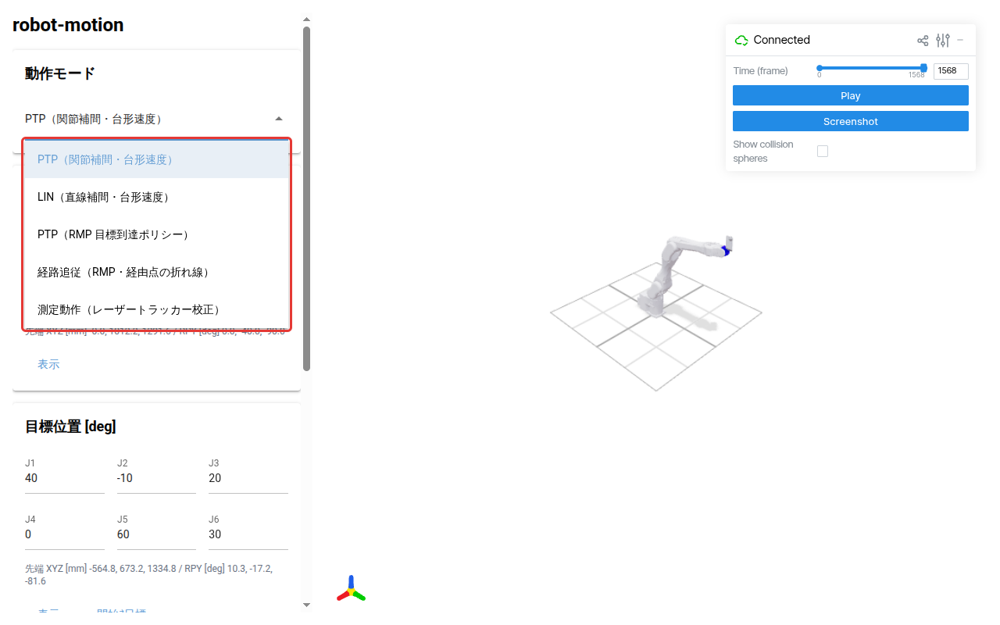

- 「動作モード」の欄を押し、**5 つのモード** から選ぶ
- モードによって、下に出る設定欄が変わる

---

## 3. 開始位置・目標位置を入れる

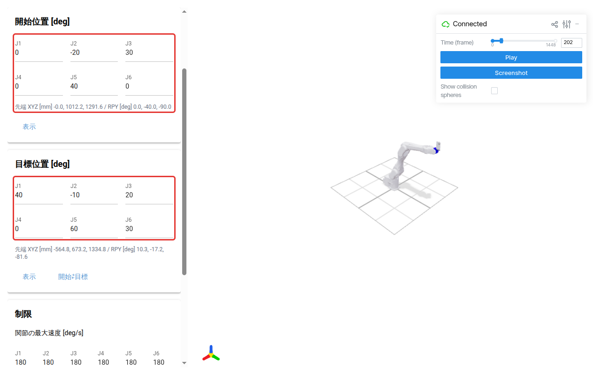

- **J1〜J6** に関節角度 [deg] を入れる
- 下の **先端 XYZ / RPY** に、その姿勢での先端の位置 [mm] と向き [deg] が出る

---

## 4. 姿勢を 3D で確かめる

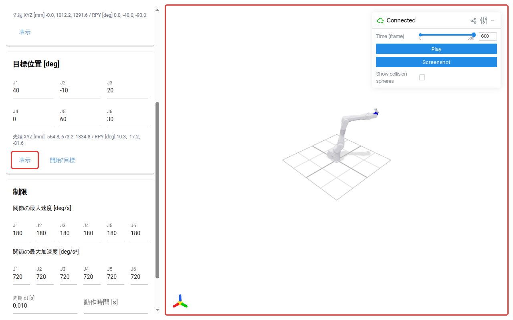

- **表示** を押すと、その姿勢が **3D 表示** に出る
- 3D 表示はドラッグで回転、ホイールで拡大・縮小できる

---

## 5. 開始と目標を入れ替える

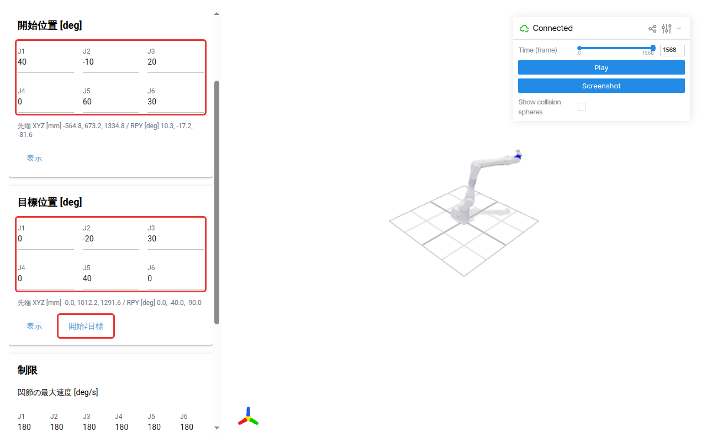

- **開始⇄目標** を押すと、**開始位置** と **目標位置** が入れ替わる
- 往復の動きを作るときに使う（経由点は順番が逆になる）

---

<!-- header: PTP（関節補間） -->

## 6. 制限を決める

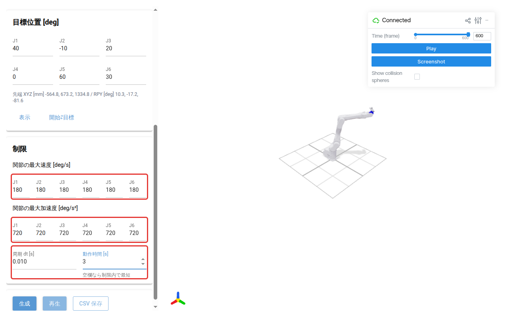

- **関節の最大速度・最大加速度** を関節ごとに入れる
- **周期 dt** は軌道の点の間隔 [s]。**動作時間** は空欄なら制限内で最短、入れるとその時間で動く

---

## 7. 軌道を生成する

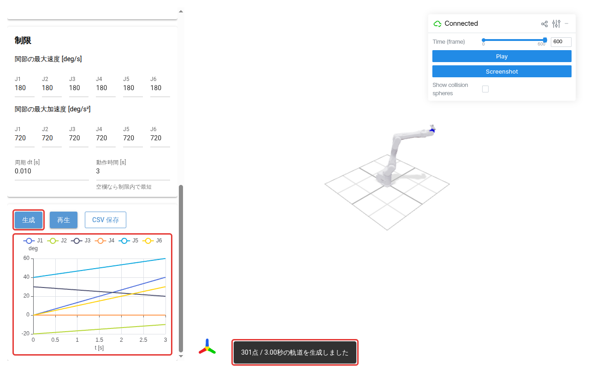

- **生成** を押すと、関節角度の **グラフ** が出る
- 下に **点の数と動作時間** が表示される

---

## 8. 3D で再生する

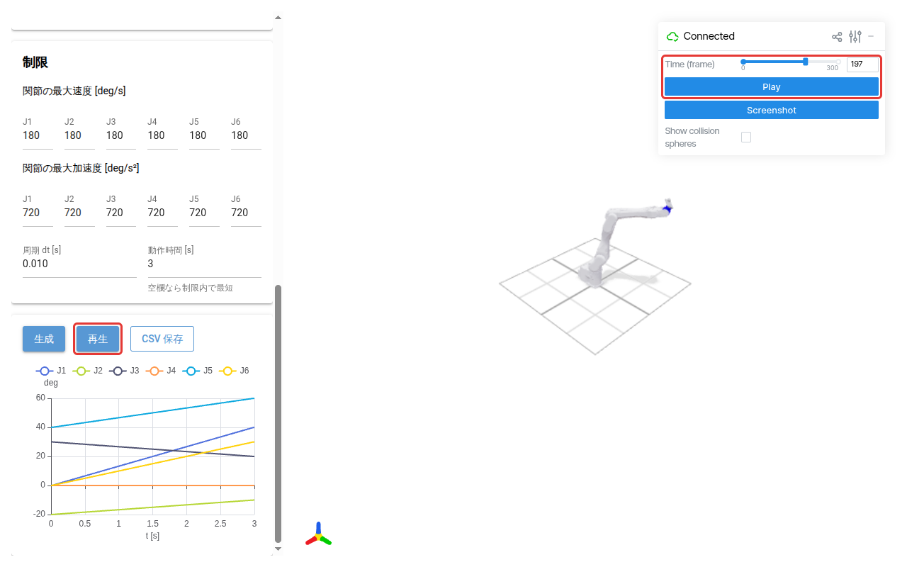

- **再生** を押すと、3D 表示のアームが軌道どおりに動く
- 3D 表示の **Time スライダー** で好きな時刻へ動かせる。**Play / Stop** で再生・停止

---

## 9. CSV で保存する

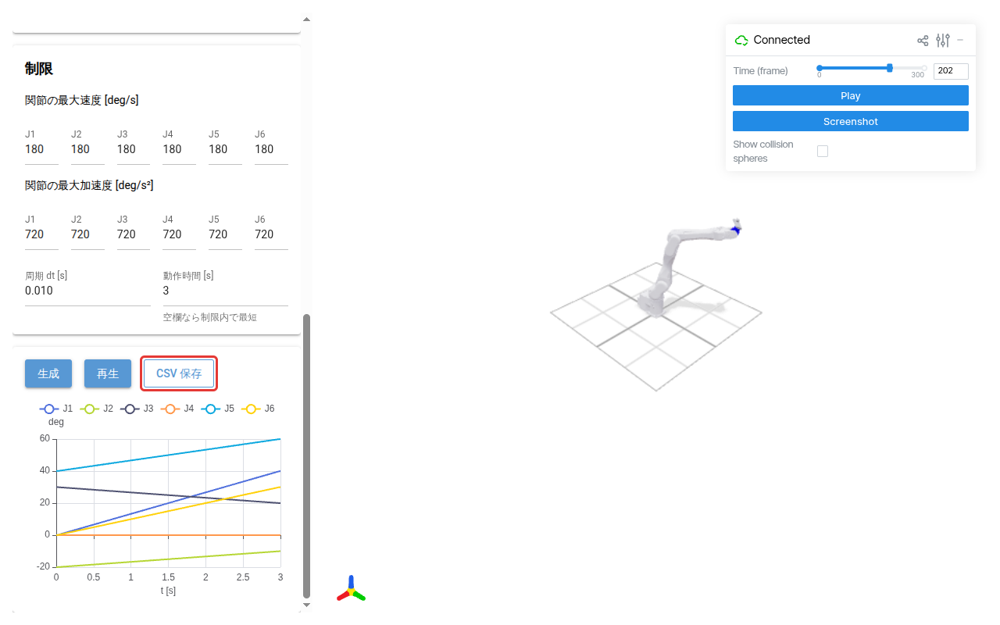

- **CSV 保存** を押すと、軌道が CSV ファイルでダウンロードされる
- ファイル名は「モード_日時.csv」。形式は付録を参照

---

<!-- header: LIN（直線補間） -->

## 10. 先端の速度を決める

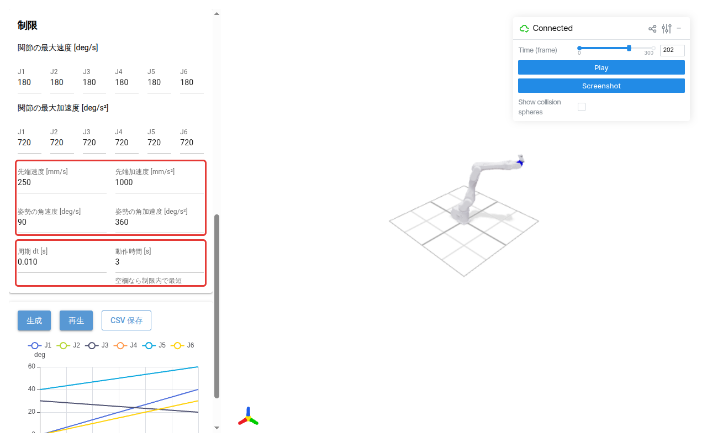

- 動作モードで LIN を選ぶと、**先端の速度・加速度と姿勢の角速度・角加速度** の欄が出る
- 関節の最大速度・加速度も超えないよう、必要なら時間を延ばす。**dt・動作時間** は PTP と同じ

---

<!-- header: PTP（RMP 目標到達ポリシー） -->

## 11. 目標到達ポリシーで生成する


- 動作モードで「PTP（RMP 目標到達ポリシー）」を選び、**生成** を押す
- 動作時間の欄はない。目標にゆっくり近づいて止まるまでの時間が、**グラフ** と **通知** に出る

---

<!-- header: 経路追従（RMP・経由点の折れ線） -->

## 12. 経由点を追加する

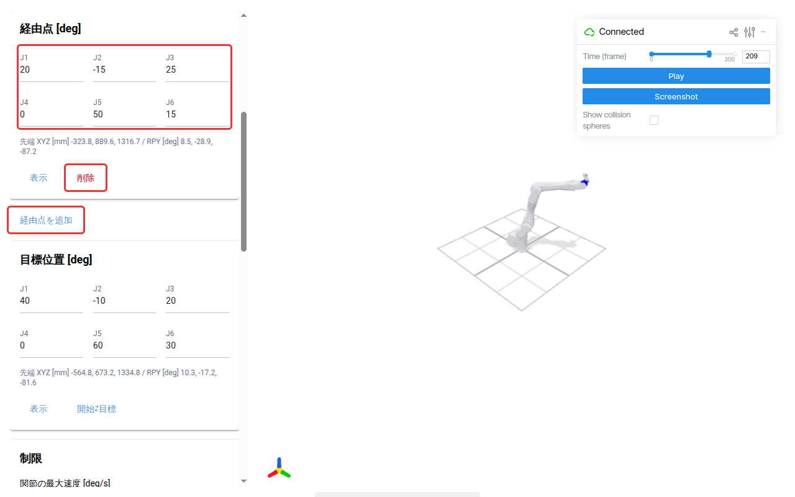

- **経由点を追加** を押すと、開始と目標の間に **経由点** の欄が増える（初期値は開始と目標の中間）
- 何個でも追加できる。**削除** で消す

---

## 13. 角の丸めを決める

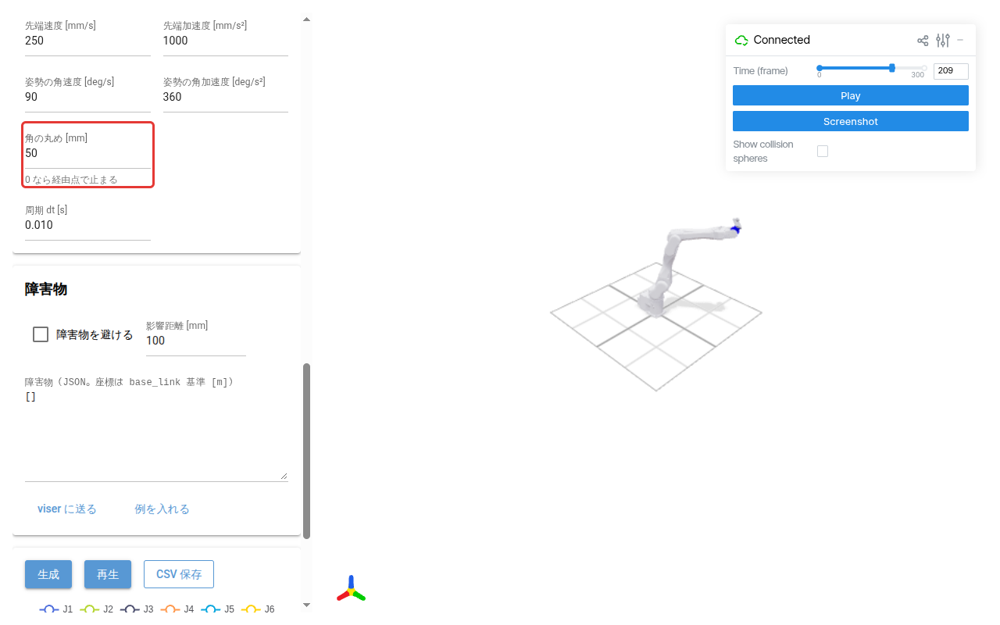

- **角の丸め** [mm] は、経由点の角をどれだけ手前から丸めるか
- 0 にすると尖った角になり、経由点でほぼ止まる

---

## 14. 経路追従で生成する

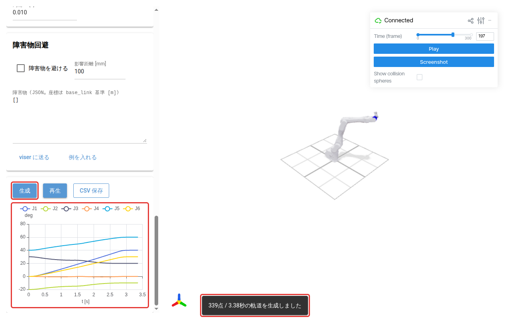

- **生成** を押すと、先端が開始 → 経由点 → 目標を結ぶ線に沿って動く **軌道** ができる
- 先端の速度・加速度の制限（手順 10 と同じ欄）を守って進む

---

<!-- header: 障害物回避（RMP・経路追従のとき） -->

## 15. 障害物を入れる

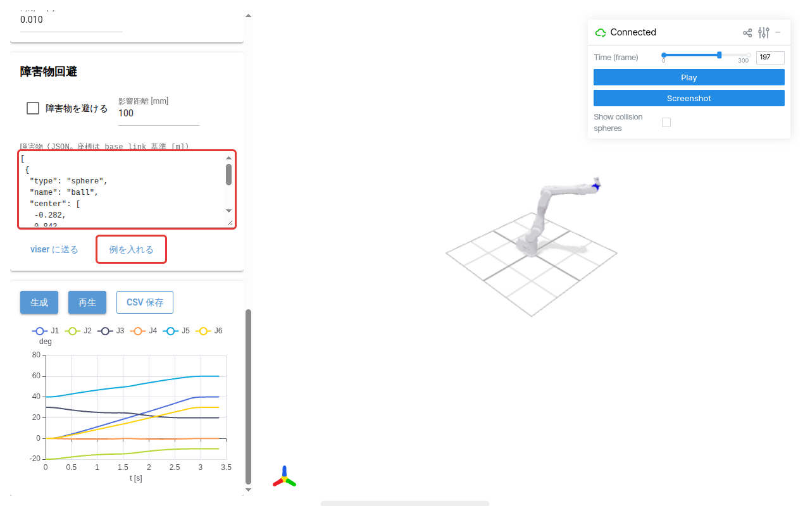

- **例を入れる** を押すと、開始と目標の先端の中間に球を置いた例が **障害物の欄** に入る
- 自分で書くときの形式は付録を参照

---

## 16. 障害物を 3D 表示に送る

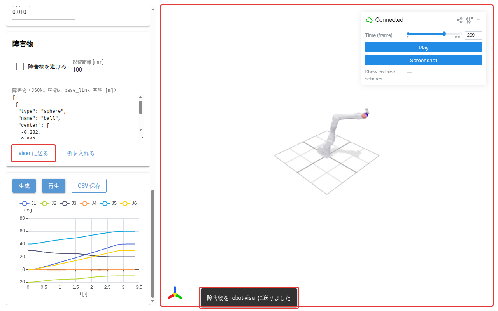

- **viser に送る** を押すと、障害物が **3D 表示** に出る
- 送れたら **通知** が出る

---

## 17. 障害物を避ける

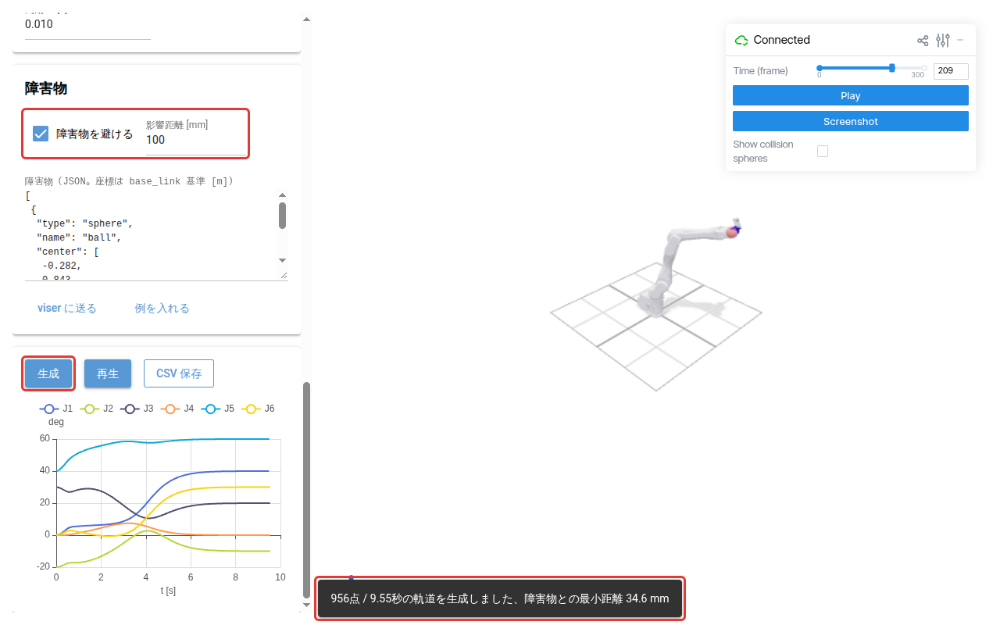

- **障害物を避ける** にチェックを入れ、**影響距離**（これより近づくと避け始める距離 [mm]）を決めて **生成** を押す
- 通知に **障害物との最小距離** が出る。生成に 10 秒ほどかかることがある

---

<!-- header: 測定動作（レーザートラッカー校正） -->

## 18. 測定の条件を入れる

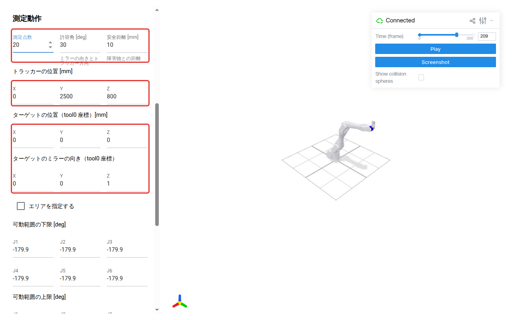

- 動作モードで「測定動作」を選ぶと、開始・目標の欄が消え、**測定点数・許容角・安全距離** の欄が出る
- **トラッカーの位置** [mm] と、**ターゲット（反射球）の位置・ミラーの向き**（先端の座標）を入れる
- 許容角は、ミラーの向きとトラッカーの方向のずれの上限

---

## 19. エリアと可動範囲を決める

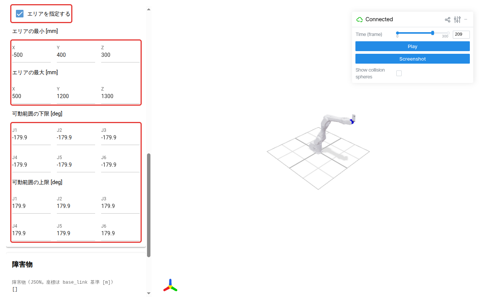

- **エリアを指定する** にチェックを入れ、ターゲットを置く **箱の最小・最大** [mm] を入れる
- 指定しなければ、ロボットの届く範囲全体から選ぶ
- **可動範囲** は、測定で使ってよい関節角度の範囲 [deg]

---

## 20. 床などの障害物を入れる

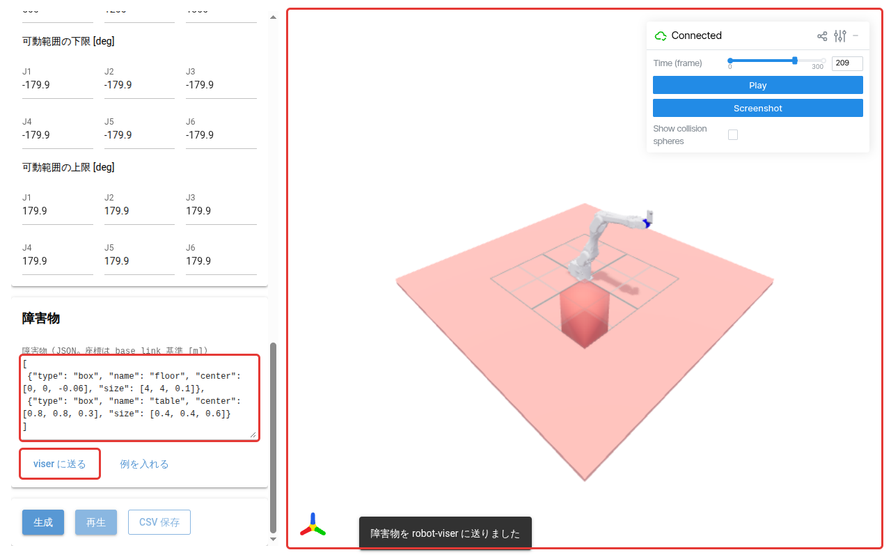

- 床や周りの装置を **障害物の欄** に書き、**viser に送る** を押して **3D 表示** で確かめる
- 測定動作では、障害物に安全距離より近づく姿勢や移動を使わない（書き方は付録）

---

## 21. 測定動作を生成する

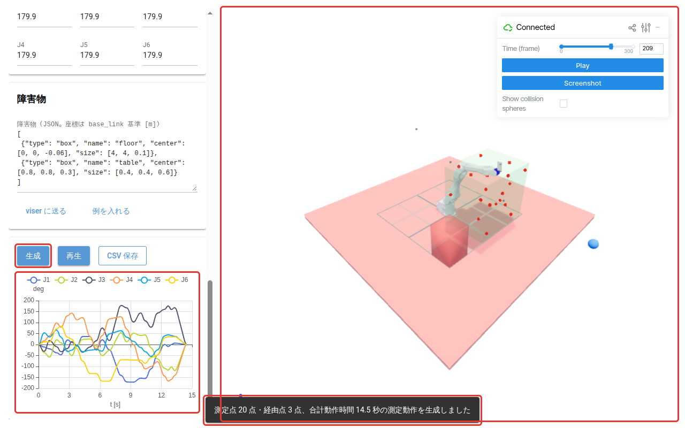

- **生成** を押すと、全軸 0° から測定点を回って 0° に戻る動作ができ、**グラフ** と **通知** が出る
- **3D 表示** に、トラッカー（青い球）・測定点（赤）・経由点（灰）・エリア（緑の箱）が出る
- 生成には数秒〜十数秒かかる

---

## 22. 再生して CSV を保存する

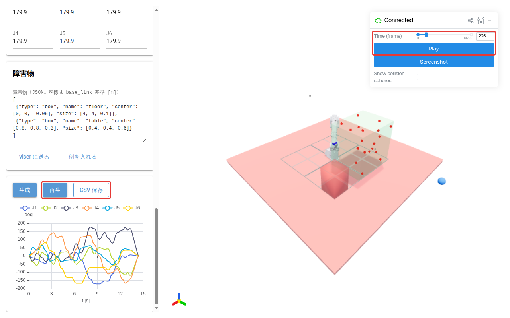

- **再生** を押すと、各点で止まりながら回る動きを **3D 表示** で確かめられる
- **CSV 保存** では、測定点・経由点の関節角度の一覧が保存される（形式は付録）

---

<!-- header: 困ったとき -->

## 23. LIN で生成できない

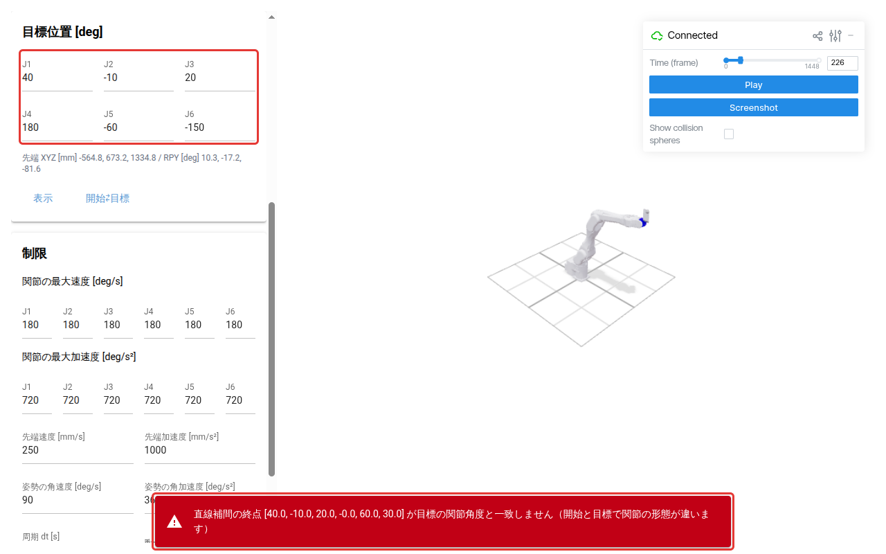

- 開始と目標で **関節の形態**（手首の向きなど）が違うと、**赤い通知** が出て生成できない
- 先端の位置・向きが同じでも、関節角度の組み合わせが違えば起こる。PTP か RMP を使う

---

## 24. 障害物の JSON が読めない

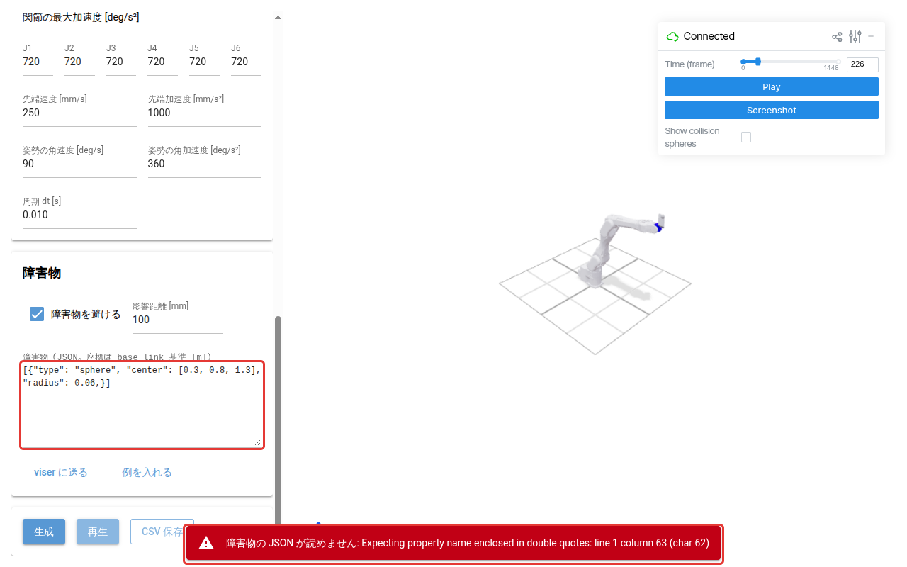

- **障害物の欄** の書き方が間違っていると、生成や送信のときに **赤い通知** が出る
- よくある原因：最後の `,` の消し忘れ、`"` の抜け。「例を入れる」で出る形に合わせる

---

## 25. 測定点が見つからない

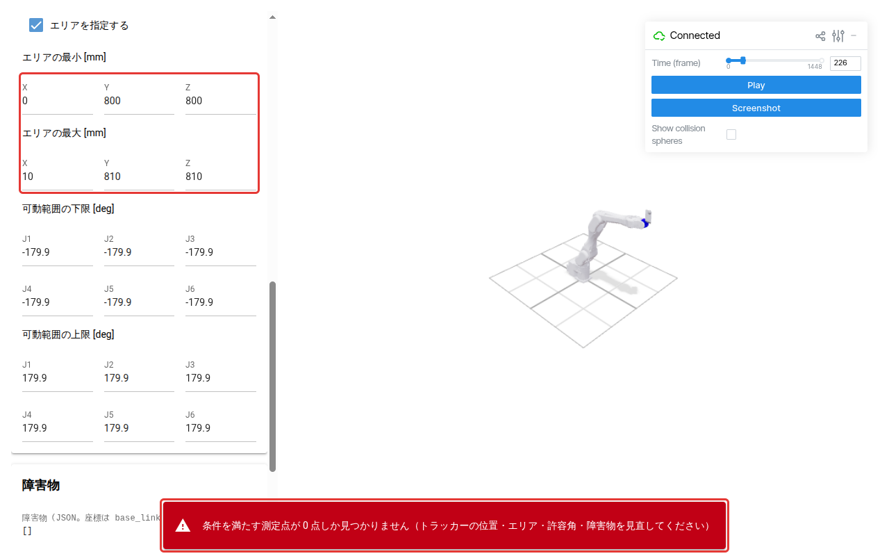

- 条件に合う測定点が足りないと、**赤い通知** が出て生成できない
- **エリア** が狭すぎる、トラッカーから見えない位置にある、許容角が小さすぎる、障害物に囲まれている、などが原因。条件を緩めるか、測定点数を減らす

---

## 生成できないときの主な理由

| 表示される内容 | よくある原因 | 対処 |
|---|---|---|
| 直線補間の終点 … が目標の関節角度と一致しません | 開始と目標で関節の形態が違う | PTP・RMP を使う |
| 直線経路上で逆運動学が解けません | 直線の途中で可動範囲外・特異点を通る | 経由点を足して経路追従にする |
| 目標の手前で止まりました／終点の手前で止まりました | 障害物で行き止まり、関節の形態が違う | 経由点を足す、目標を見直す |
| … 秒以内に収束しません | 関節の形態が違う | 目標の関節角度を見直す |
| 障害物にめり込みました | 開始姿勢や経路が障害物に重なっている | 障害物の位置・影響距離を見直す |
| 障害物の形式が違います | 必要な項目（`name` など）が足りない | 付録の書き方に合わせる |
| 条件を満たす測定点が … 点しか見つかりません | エリアが狭い、トラッカーから見えない、許容角が小さい | エリア・トラッカーの位置・許容角を見直す、測定点数を減らす |
| 障害物の欄・測定動作の生成で「衝突判定が無効です」「衝突判定が必要です」 | robot-viser-app を衝突判定なしで起動している | `COLLISION=1 docker compose up -d` で起動し直す |

---

<!-- header: 付録 -->

## 付録：CSV の形式

robot-viser-app がそのまま読める形式です。

```
t,joint1,joint2,joint3,joint4,joint5,joint6
0.0000,0.000000,-20.000000,30.000000,0.000000,40.000000,0.000000
0.0100,0.036000,-19.991000,29.991000,0.000000,40.018000,0.027000
...
```

- `t` は秒、`joint1`〜`joint6` は関節角度 [deg]
- 1 行目が見出し、2 行目から周期 dt ごとの点

---

## 付録：測定動作の CSV の形式

測定動作の「CSV 保存」では、止まる点の関節角度を順に並べた一覧が保存されます。

```
no,label,joint1,joint2,joint3,joint4,joint5,joint6
0,start,0.000000,0.000000,0.000000,0.000000,0.000000,0.000000
1,measure,40.562011,-54.731056,39.474575,-55.082728,62.268403,6.321836
...
```

- `label` は `start`（全軸 0°）・`measure`（測定点）・`via`（障害物を避けるための経由点）・`end`（全軸 0° に戻る）
- `joint1`〜`joint6` は関節角度 [deg]

---

## 付録：障害物の書き方

座標はロボットの土台（base_link）が基準で、単位は **m**（画面のほかの欄は mm）。

```json
[
 {"type": "sphere",  "name": "ball", "center": [-0.28, 0.84, 1.31], "radius": 0.06},
 {"type": "box",     "name": "wall", "center": [0.5, 0.0, 0.3], "size": [0.1, 0.4, 0.4]},
 {"type": "capsule", "name": "pole", "p1": [0.4, 0.3, 0.0], "p2": [0.4, 0.3, 1.0], "radius": 0.05}
]
```

- 球（`sphere`：中心と半径）・直方体（`box`：中心と各辺の長さ）・カプセル（`capsule`：両端の点と半径）が使える
- どれも `name`（名前）が必要。直方体は `"rpy": [0, 0, 0.5]` のように傾き [rad] も書ける
- 全体を `[ ]` で囲み、障害物どうしは `,` で区切る
